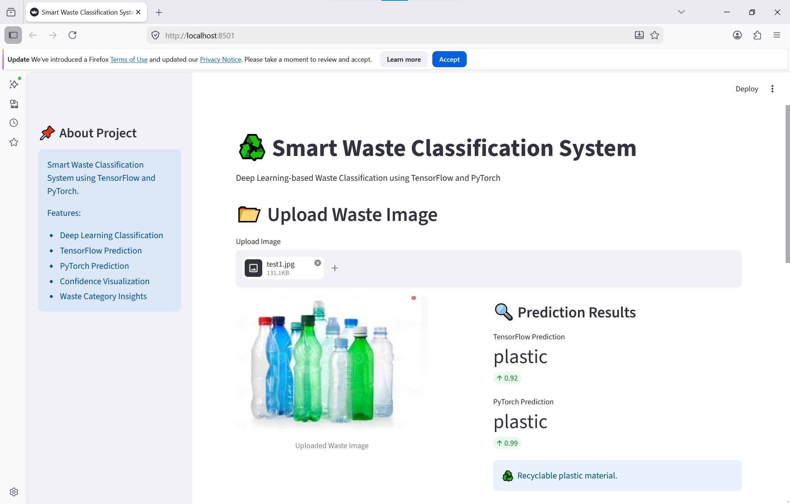
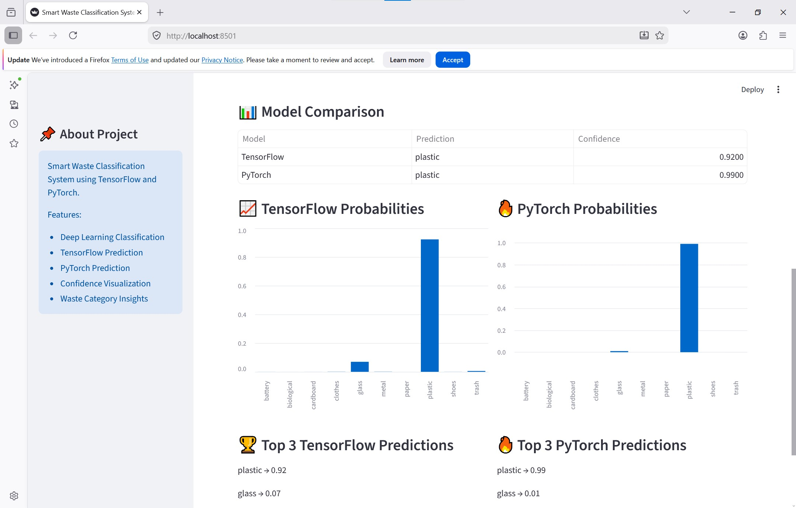
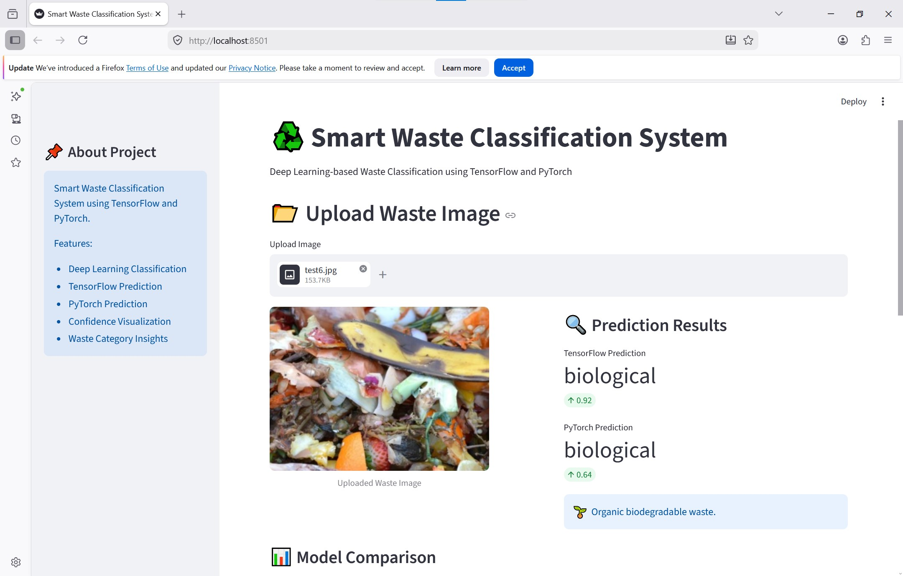
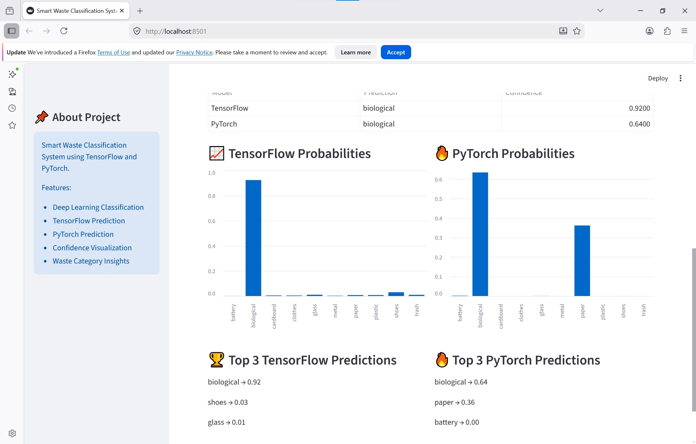

# ♻️ Smart Waste Classification System using TensorFlow & PyTorch

Deep learning-based waste classification system developed using TensorFlow, PyTorch, and Streamlit for identifying recyclable and non-recyclable waste materials from image inputs.

---

#  Features

- Multi-class waste image classification
- TensorFlow and PyTorch prediction comparison
- Confidence score visualization
- Top-3 prediction analysis
- Interactive Streamlit web application
- Real-time image upload prediction
- Comparative deep learning workflow
- Waste category insights

---

#  Technologies Used

| Technology | Purpose |
|---|---|
| Python | Core Programming |
| TensorFlow | Deep Learning Model |
| PyTorch | Deep Learning Model |
| Streamlit | Web Application |
| torchvision | Computer Vision Utilities |
| NumPy | Numerical Computing |
| pandas | Data Handling |
| PIL (Pillow) | Image Processing |

---

#  Waste Categories

- Battery
- Biological
- Cardboard
- Clothes
- Glass
- Metal
- Paper
- Plastic
- Shoes
- Trash

---

#  Project Workflow

```text
Image Upload
      ↓
Image Preprocessing
      ↓
TensorFlow Prediction
      ↓
PyTorch Prediction
      ↓
Confidence Analysis
      ↓
Visualization Dashboard
```

---

#  Features Demonstrated

✅ Deep Learning Classification  
✅ Transfer Learning  
✅ TensorFlow & PyTorch Integration  
✅ Comparative Model Evaluation  
✅ Streamlit Deployment  
✅ Confidence Visualization  
✅ Top-3 Prediction Analysis  
✅ Real-world Waste Classification

---

# Streamlit Dashboard

The application supports:

- Waste image upload
- TensorFlow prediction
- PyTorch prediction
- Probability visualization
- Comparative prediction analysis
- Confidence charts
- Top-3 prediction insights

---

#  Installation

## 1. Clone Repository

```bash
git clone https://github.com/yourusername/smart-waste-classification.git
cd smart-waste-classification
```

---

## 2. Create Virtual Environment

### Windows

```bash
python -m venv wenv
wenv\Scripts\activate
```

---

## 3. Install Requirements

```bash
pip install -r requirements.txt
```

---

#  Run Application

```bash
python -m streamlit run app.py
```

---

#  Example Predictions

```text
TensorFlow → Plastic (0.92)
PyTorch → Plastic (0.89)
```

---

#  Project Highlights

- Implemented transfer learning workflows for image classification
- Built comparative prediction system using TensorFlow and PyTorch
- Developed an interactive AI-powered Streamlit dashboard
- Performed preprocessing, model training, and evaluation on real-world waste datasets
- Visualized prediction confidence and class probabilities

---

#  Future Improvements

- Real-time webcam prediction
- YOLO-based object detection
- Cloud deployment
- Mobile-friendly interface
- Explainable AI visualizations
- Database integration

---

# Screenshots

## Prediction Dashboard









---

#  Note

Model files are not uploaded due to GitHub file size limitations.

---


